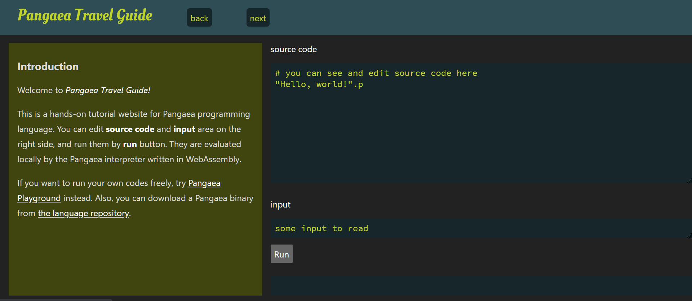

# pangaea-travel-guide

Online tutorial of Pangaea programming language (https://github.com/Syuparn/Pangaea)

## Web site

Visit https://syuparn.github.io/pangaea-travel-guide/



## Dependencies

- npm
- Svelte
- svelte-routing

## For developers

### Run locally

```bash
# download dependencies
$ wget -P ./public https://raw.githubusercontent.com/Syuparn/Pangaea/gh-pages/main.wasm
$ wget -P ./public https://raw.githubusercontent.com/golang/go/go1.18/misc/wasm/wasm_exec.js

$ npm install
# run on localhost:5000
$ npm run dev
```
